# R1: модель данных личного кабинета

Статус: реализованная R1 schema model в migrations `005`–`012`. Целевая СУБД —
PostgreSQL 17. Существующие таблицы заявок и согласий не переписываются; Telegram
subscription расширяется nullable account linkage.

## Инварианты

- `login_normalized` и `email_normalized` уникальны без учёта регистра.
- У пользователя ровно один профиль и один credential; профессиональная роль
  профиля не предоставляет прав доступа.
- Raw password и raw одноразовые/refresh tokens в БД не хранятся.
- Telegram bot-auth state хранит только `chat_id`, этап и nullable `user_id`;
  введённые login/password не записываются. Состояние живёт не более 5 минут.
- Активные Telegram-привязки уникальны одновременно по пользователю и private
  chat; повторная привязка допустима только после явного revoke старой записи.
- Активный account может иметь `email_verified_at = NULL`, если он подтверждён
  через Telegram; это не считается подтверждением адреса электронной почты.
- Один проект имеет не более одного активного заказчика. `customer_user_id`
  может быть `NULL` только для проекта, созданного `super_admin`.
- Активная роль участника уникальна в проекте; один user может одновременно
  иметь customer и project_admin, а отозванное участие сохраняется для истории.
- Последний активный `super_admin` не может быть отключён.
- Audit append-only. Удаление пользователя не удаляет историю проекта и audit.
- Время хранится как `TIMESTAMPTZ` в UTC; календарные отчётные периоды получают
  явную timezone `Europe/Moscow` на границе сценария.
- Вертикальный срез сводки проекта хранит дедлайн задачи и границы встречи как
  UTC instants. Он не закрывает R2/R5: назначения, task lifecycle и единый
  календарный feed остаются задачами соответствующих релизов.
- Тема хранится одной строкой на пользователя; период ближайших событий хранится
  отдельно для каждой пары `(project_id, user_id)`. Браузер не является
  источником этих настроек.

## ERD

```mermaid
erDiagram
    PROFESSIONAL_ROLES ||--o{ PROFILES : classifies
    USERS ||--|| PROFILES : has
    USERS ||--|| CREDENTIALS : authenticates_with
    USERS ||--o{ SESSIONS : owns
    USERS ||--o{ EMAIL_VERIFICATION_TOKENS : verifies_with
    USERS ||--o{ PASSWORD_RESET_TOKENS : resets_with
    USERS ||--o{ TELEGRAM_ACCOUNT_BINDINGS : links
    USERS ||--o| ACCOUNT_NOTIFICATION_PREFERENCES : configures
    USERS ||--o{ TELEGRAM_BOT_AUTH_STATES : may_match
    USERS ||--o{ PROJECTS : creates
    USERS ||--o{ PROJECTS : may_be_customer
    USERS ||--o{ PROJECT_MEMBERSHIPS : participates
    USERS ||--o| USER_SETTINGS : configures
    USERS ||--o{ PROJECT_USER_SETTINGS : configures
    PROJECTS ||--o{ PROJECT_MEMBERSHIPS : contains
    PROJECTS ||--o{ PROJECT_USER_SETTINGS : configures
    PROJECTS ||--o{ PROJECT_TASKS : contains
    PROJECTS ||--o{ PROJECT_MEETINGS : schedules
    USERS ||--o{ AUDIT_EVENTS : may_act
    USERS ||--o{ NOTIFICATION_OUTBOX : may_receive
    USERS ||--o{ REPORT_DELIVERIES : receives
    NOTIFICATION_OUTBOX o|--o| REPORT_DELIVERIES : dispatches

    PROFESSIONAL_ROLES {
        uuid id PK
        text code UK
        text name
        bool is_active
        timestamptz created_at
    }
    USERS {
        uuid id PK
        text login
        text login_normalized UK
        text email
        text email_normalized UK
        text global_role
        text status
        timestamptz email_verified_at
        timestamptz last_login_at
        timestamptz created_at
        bigint version
    }
    PROFILES {
        uuid user_id PK, FK
        uuid professional_role_id FK
        text first_name
        text last_name "Nullable"
        text middle_name "Nullable"
        timestamptz updated_at
    }
    USER_SETTINGS {
        uuid user_id PK, FK
        text theme
        timestamptz updated_at
    }
    PROJECT_USER_SETTINGS {
        uuid project_id PK, FK
        uuid user_id PK, FK
        smallint upcoming_days
        timestamptz updated_at
    }
    CREDENTIALS {
        uuid user_id PK, FK
        text password_hash "Argon2id PHC"
        text algorithm
        jsonb parameters
        int hash_version
        timestamptz password_changed_at
    }
    SESSIONS {
        uuid id PK
        uuid user_id FK
        uuid family_id
        bytea access_token_hash UK
        bytea refresh_token_hash UK
        bytea csrf_token_hash
        int hash_key_version
        bigint captured_security_version
        uuid replaced_by_session_id "Nullable"
        timestamptz last_seen_at
        timestamptz idle_expires_at
        timestamptz absolute_expires_at
        timestamptz revoked_at "Nullable"
    }
    EMAIL_VERIFICATION_TOKENS {
        uuid id PK
        uuid user_id FK
        bytea token_hash UK
        int hash_key_version
        timestamptz expires_at
        timestamptz consumed_at "Nullable"
        timestamptz created_at
    }
    PASSWORD_RESET_TOKENS {
        uuid id PK
        uuid user_id FK
        bytea token_hash UK
        int hash_key_version
        timestamptz expires_at
        timestamptz consumed_at "Nullable"
        timestamptz created_at
    }
    TELEGRAM_BOT_AUTH_STATES {
        bigint chat_id PK
        text flow
        text step
        uuid candidate_user_id FK "Nullable"
        text request_id
        int failed_attempts
        timestamptz started_at
        timestamptz expires_at "Max 5 minutes"
    }
    TELEGRAM_ACCOUNT_BINDINGS {
        uuid id PK
        uuid user_id FK
        bigint chat_id
        text chat_username "Nullable"
        timestamptz verified_at
        timestamptz revoked_at "Nullable"
        text revoke_reason "Nullable"
        bigint version
    }
    ACCOUNT_NOTIFICATION_PREFERENCES {
        uuid user_id PK, FK
        text verification_channel
        text recovery_channel
        bool telegram_events_enabled
        timestamptz updated_at
    }
    AUTH_RATE_LIMIT_BUCKETS {
        text policy_code PK
        bytea subject_hash PK
        int hash_key_version
        numeric tokens
        timestamptz last_refill_at
        timestamptz blocked_until "Nullable"
        timestamptz expires_at
    }
    PROJECTS {
        uuid id PK
        uuid created_by_user_id FK
        uuid customer_user_id FK "Nullable for super-admin flow"
        text name
        text status
        date planned_start_on "Nullable"
        date planned_finish_on "Nullable"
        text currency_code
        timestamptz created_at
        bigint version
    }
    PROJECT_MEMBERSHIPS {
        uuid id PK
        uuid project_id FK
        uuid user_id FK
        text project_role
        jsonb privileges
        timestamptz joined_at
        timestamptz revoked_at "Nullable"
        bigint version
    }
    PROJECT_TASKS {
        uuid id PK
        uuid project_id FK
        uuid created_by_user_id FK
        text title
        text description "Nullable"
        text status
        timestamptz due_at
        bigint version
    }
    PROJECT_MEETINGS {
        uuid id PK
        uuid project_id FK
        uuid created_by_user_id FK
        text title
        text description "Nullable"
        text location "Nullable"
        timestamptz starts_at
        timestamptz ends_at
        bigint version
    }
    AUDIT_EVENTS {
        bigint id PK
        uuid actor_user_id FK "Nullable for system"
        text event_type
        text subject_type
        uuid subject_id "Nullable"
        text result
        jsonb metadata
        timestamptz occurred_at
    }
    MONITORING_SAMPLES {
        bigint id PK
        timestamptz sample_slot UK
        text collector_status
        jsonb metrics
    }
    MONITORING_INCIDENTS {
        uuid id PK
        text incident_type
        text resource_key
        text state
        timestamptz first_seen_at
        timestamptz resolved_at "Nullable"
    }
    NOTIFICATION_OUTBOX {
        uuid id PK
        uuid recipient_user_id FK "Nullable"
        text channel
        text message_type
        text idempotency_key UK
        bytea payload_ciphertext
        int payload_key_version
        jsonb metadata
        int attempts
        timestamptz available_at
        timestamptz delivered_at "Nullable"
        timestamptz created_at
    }
    REPORT_DELIVERIES {
        uuid id PK
        text report_type
        timestamptz period_start
        timestamptz period_end
        uuid recipient_id FK
        uuid outbox_id FK
        jsonb aggregate_payload
        text state
    }
```

Figma-версия ERD: страница `09 — Client Cabinet / R1 Data Model` (`666:2`),
проверенный root frame `666:3`.

## Словарь данных

| Таблица | Владелец | Tenant scope | Nullability / uniqueness | Delete и retention | PII | Оценка роста |
| --- | --- | --- | --- | --- | --- | --- |
| `professional_roles` | Identity | global | `code` unique, поля required | deactivate; не удалять используемую роль | нет | десятки строк |
| `users` | Identity | global | login/email normalized unique; `global_role` nullable | status disable; физическое удаление только отдельной процедурой | login, email | до 10 тыс. пользователей |
| `profiles` | Identity | user | `user_id` PK/FK; имя required, фамилия/отчество nullable | следует lifecycle user, но сохраняется при disable | ФИО | одна строка на user |
| `credentials` | Identity | user | одна строка на user; hash required | заменить hash при смене; удалить при legal erasure | security secret, не ПДн-экспорт | одна строка на user |
| `sessions` | Session | user | token hash unique; revoke nullable | удалить через 120 дней после expiry/revoke | технические идентификаторы | до 20 активных/исторических на user, очистка batch |
| `email_verification_tokens` | Identity | user | token hash unique; consumed nullable | удалить через 30 дней после expiry/consume | связь с user | низкий, очистка batch |
| `password_reset_tokens` | Identity | user | token hash unique; consumed nullable | удалить через 30 дней после expiry/consume | связь с user | низкий, очистка batch |
| `auth_rate_limit_buckets` | Identity | global pseudonymous subject | `(policy_code, subject_hash)` PK; atomic token bucket | удалить через 48 часов inactivity | краткоживущий HMAC marker, без raw IP/login/email | bounded by active auth subjects/policies |
| `telegram_bot_auth_states` | Identity | private Telegram chat | один state на `chat_id`; TTL ≤5 минут; `candidate_user_id` nullable | удалить после success/failure/expiry; password/login отсутствуют | chat id, nullable user id | не более active bot dialogs |
| `telegram_account_bindings` | Identity | user | по одному active binding на user и chat | revoke вместо delete; history сохраняется | user id, chat id, username | низкий, несколько исторических строк на user |
| `account_notification_preferences` | Identity | user | одна строка на user; каналы ограничены email/telegram | следует lifecycle user | user id, preferences | одна строка на user |
| `projects` | Projects | project | customer nullable только для super-admin flow; optimistic `version` | soft archive; история сохраняется | адрес/описание появятся отдельными полями migration | до десятков на user |
| `project_memberships` | Projects | project | unique active `(project_id,user_id)`; одна active customer membership | revoke вместо delete | связь user-project | десятки на project |
| `user_settings` | Settings | user | `user_id` PK/FK; theme `light`/`dark` | cascade с user | user id, UI preference | одна строка на user |
| `project_user_settings` | Settings | project + user | PK `(project_id,user_id)`; `upcoming_days` 1–90 | cascade с project/user | связь user-project, UI preference | участники × проекты |
| `audit_events` | Audit | global/project | actor nullable для system; append-only | security: 365 дней; значимые project events — срок проекта + 3 года | может содержать user id, metadata проходит allowlist | основной рост: auth events; partition review при 10 млн строк |
| `monitoring_samples` | Monitoring | global | `sample_slot` unique | 90 дней raw samples, затем удалить bounded batch | только технические агрегаты | 96 строк/сутки |
| `monitoring_incidents` | Monitoring | global | один open incident на `(type,resource)` | 365 дней после recovery | только технические агрегаты | низкий |
| `notification_outbox` | Notifications | global/project | `idempotency_key` unique; encrypted payload | ciphertext purge через 30 дней after delivery; terminal — 90 дней | encrypted token/message payload, metadata allowlist | зависит от писем/Telegram; bounded retries |
| `report_deliveries` | Notifications | global | unique `(report_type,period_start,period_end,recipient_id)` | агрегаты 365 дней | recipient user id; payload без ПДн | recipients × reports |

Retention является продуктовой политикой R1 и должна быть сверена с политикой
обработки персональных данных до production. Audit metadata запрещено заполнять
произвольным request body: допустимые ключи определяются для каждого event type.

## Ограничения PostgreSQL

- `CHECK (status IN (...))` применяется к стабильным техническим статусам;
  профессиональные роли остаются справочником, не enum.
- Частичный unique index обеспечивает одного активного участника:
  `(project_id, user_id, project_role) WHERE revoked_at IS NULL`, поскольку один
  пользователь может одновременно быть customer и project_admin.
- Частичный unique index обеспечивает одного активного заказчика:
  `(project_id) WHERE project_role = 'customer' AND revoked_at IS NULL`.
- Согласованность `projects.customer_user_id` и customer membership проверяет
  application transaction плюс deferred constraint trigger; простая проверка
  `SELECT` перед `INSERT` не считается защитой от гонки.
- Отключение последнего super-admin выполняется conditional update в транзакции
  под единым transaction advisory lock Identity-модуля, блокировкой target row
  и повторной проверкой количества; disable/demote/delete используют один guard.

## Транзакционные границы

1. Registration: `users + profiles + credentials + verification token + audit +
   email outbox` в одной транзакции.
2. Login: проверка credential вне долгой транзакции; создание session,
   `last_login_at` и audit success фиксируются атомарно после успешной проверки.
3. Password reset: consume token, replace credential, revoke all sessions,
   audit и notification outbox — одна транзакция.
4. Project create: project, creator memberships, optional customer membership и
   audit — одна транзакция.
5. Disable user: status/version update, revoke sessions и audit — одна
   транзакция; сетевых вызовов внутри транзакции нет.

## Открытые проверки перед migration

- Измерить фактический объём текущей production БД и частоту auth events; оценки
  выше пока не являются измерением.
- Зафиксировать точный набор project fields и checks в OpenAPI до DDL.
- Проверить migration на пустой PostgreSQL 17 и upgrade копии схемы `0.1.0`.
- Проверить old/new application × old/new schema; R1 migration только additive.
